# Student Management System

A **Java console application** for managing Students, Teachers, and Courses.  
This project demonstrates **object-oriented programming** and **CRUD operations** in **Core Java**.

---

## Features

### Student Management
- Add Student
- View All Students
- Search Student by ID
- Update Student details
- Delete Student

### Teacher Management
- Add Teacher
- View All Teachers
- Search Teacher by ID
- Update Teacher details
- Delete Teacher

### Course Management
- Add Course
- View All Courses
- Search Course by ID
- Update Course details
- Delete Course

---

## Sample Names Used

**Students:** Aarav Sharma, Priya Verma  
**Teachers:** Rohit Kumar, Neha Verma  
**Courses:** Java Programming, Python Programming

---

## Folder Structure

StudentManagementSystem/
│
├── src/
│ └── com/studentmanagement/
│ ├── Student.java
│ ├── Teacher.java
│ ├── Course.java
│ ├── StudentManager.java
│ ├── TeacherManager.java
│ ├── CourseManager.java
│ ├── StudentMenu.java
│ ├── TeacherMenu.java
│ ├── CourseMenu.java
│ └── Main.java
│
├── screenshots/
│ └── add_student.png
├── .gitignore
└── README.md


---

## Screenshots

### Student Management
- Student Menu: 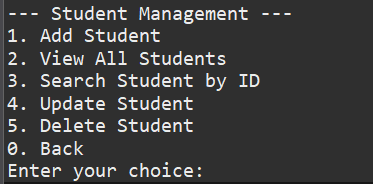
- Add Student: 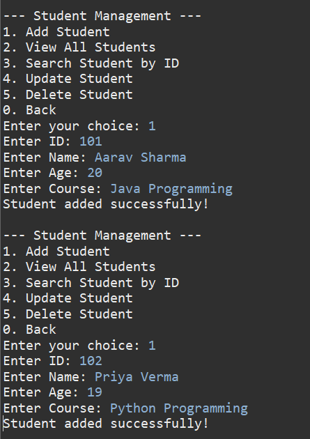
- View Students: 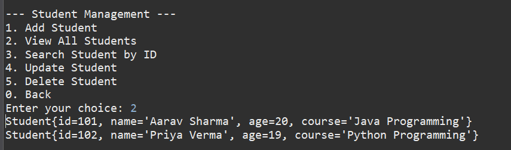
- Search Student: 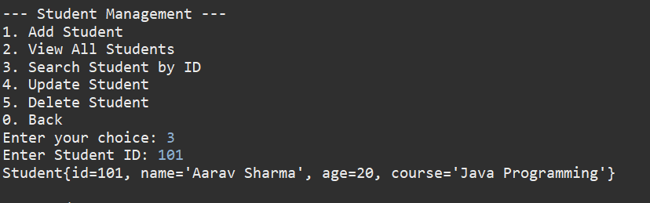
- Update Student: 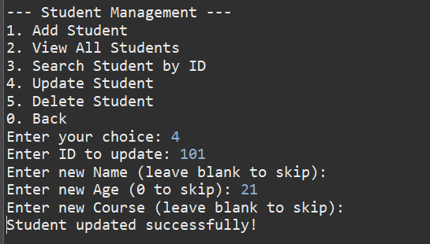
- Delete Student: 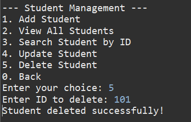

### Teacher Management
- Teacher Menu: 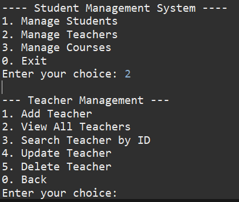
- Add Teacher: 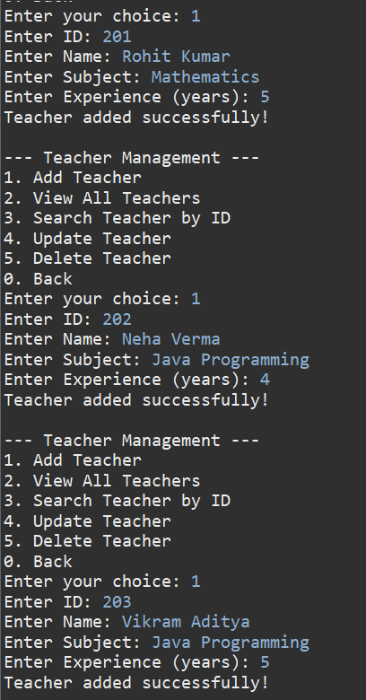
- View Teachers: 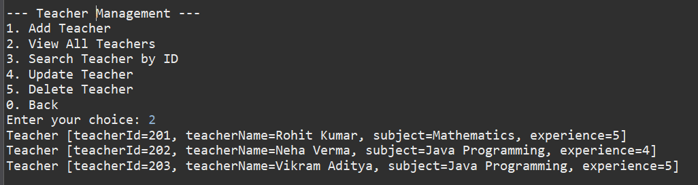
- Search Teacher: 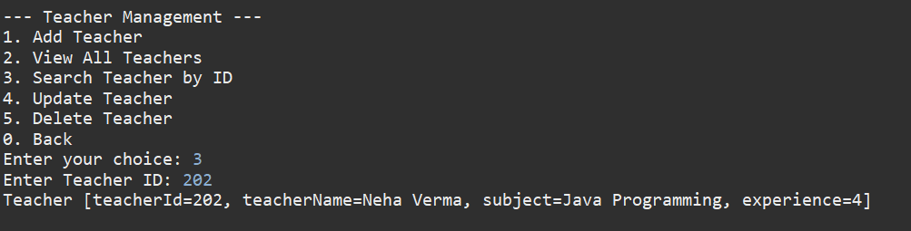
- Update Teacher: 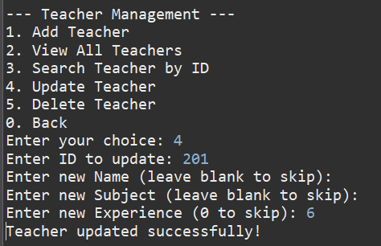
- Delete Teacher: 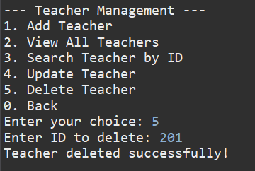

### Course Management
- Course Menu: 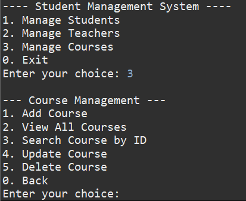
- Add Course: 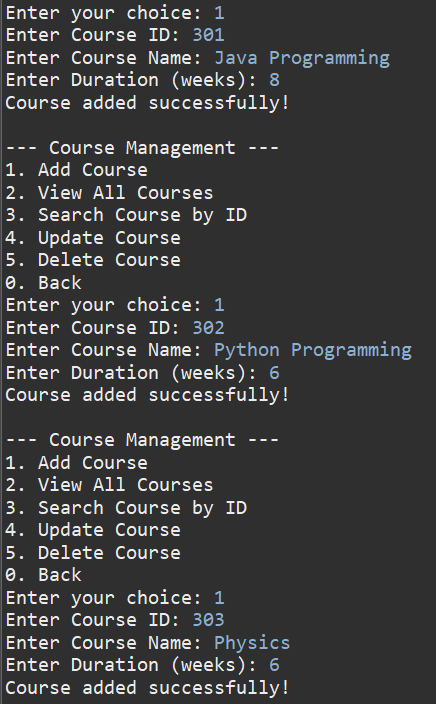
- View Courses: 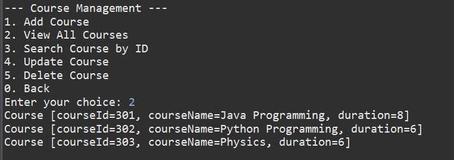
- Search Course: 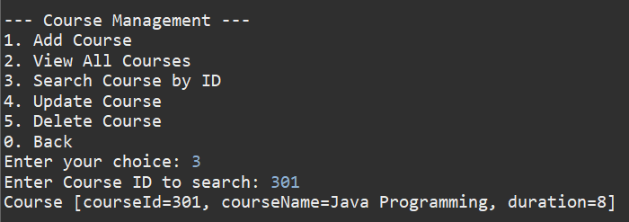
- Update Course: 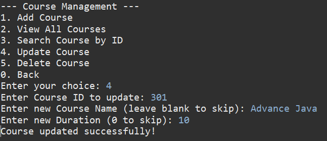
- Delete Course: 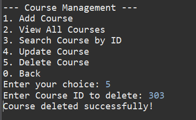

---

## How to Run

1. Clone the repository:  
```bash
git clone https://github.com/nitheeshreddy17/StudentManagementSystem.git
Open in Eclipse or any Java IDE.

Run Main.java as a Java Application.

Navigate through Student, Teacher, and Course menus.

Author
Nitheesh Reddy
Email: nitheeshreddy1705@gmail.com

